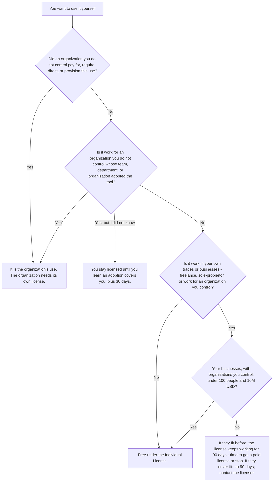
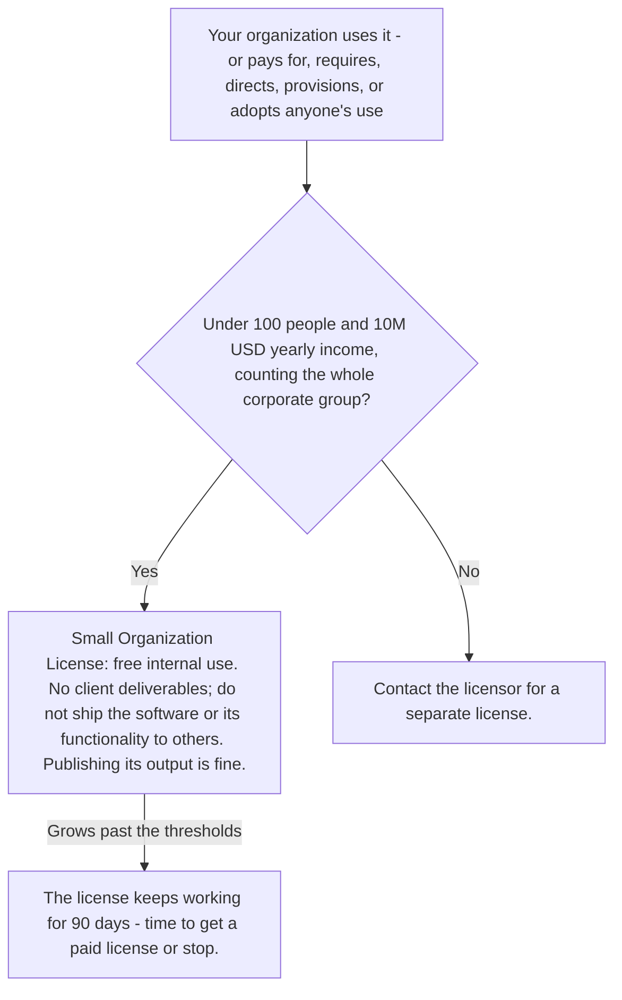

# Guide to the Individual and Small Organization License 1.0.0

**Non-binding.** This guide answers, in plain words, the questions
people actually ask about the
[Individual and Small Organization License](./1.0.0.md). It is not part
of the license: the license text governs, and if this guide and the
license ever disagree, the license wins.

## The whole model in one paragraph

People are free; business activity above small-organization scale pays,
whatever legal wrapper it wears. You can use the software for anything
personal, for your job (until your employer institutionalizes it), and
for your own freelance or sole-proprietor business while that business
stays under the small-organization thresholds (100 people and 10 million
USD a year, counted with everything you control). Organizations under
those thresholds get internal use for free. Everyone else licenses from
the licensor.

## Am I licensed? Two quick charts

For you, personally:

For an organization:

## Contents

- [Am I licensed? Two quick charts](#am-i-licensed-two-quick-charts)
- [Using it at your job](#using-it-at-your-job)
- [Freelancers and sole proprietors](#freelancers-and-sole-proprietors)
- [Small organizations](#small-organizations)
- [Larger organizations](#larger-organizations)
- [Forks, changes, and sharing](#forks-changes-and-sharing)
- [Output](#output)
- [Contributing code](#contributing-code)
- [Special cases](#special-cases)
- [About the license itself](#about-the-license-itself)

## Using it at your job

### I work at a 5,000-person company. Can I install this on my work machine and use it myself, without anyone telling me to?

**Yes**. Your use at work stays in your individual capacity - and free - as
long as no organization pays for, requires, directs, or provisions that use,
and it is not within the scope of an adoption. Your employer's size does not
matter for your own self-chosen use.

### My manager knows I use it and says it's fine. Does that turn my use into company use?

**No**. Knowing of or permitting an individual's independently chosen use is
expressly not adoption and does not, by itself, make the organization count as
using the software. Your use stays your own unless the company goes further -
paying for, requiring, directing, provisioning it, or adopting it for your
unit.

### Can I demo it to colleagues and share my setup notes and config with them?

**Yes**. Individuals sharing notes, documentation, or configuration about
their own independently chosen use with colleagues is expressly not adoption.
But watch the line: if someone with tool-setting authority coordinates that
into a recurring team practice or endorses it as the team's expected tool,
that becomes the organization's adoption.

### My manager just told our whole team to start using it. Is that still covered by my free individual license?

**No**. When an organization requires or directs the use, or designates the
tool as standard or expected for a team, that use is the organization's, not
yours - the individual license does not extend to it. The company needs its
own license (a qualifying small organization gets internal use by these terms;
larger ones must contact the licensor).

### Can I ask IT to install it on my work laptop for me?

**Yes**. IT carrying out your own request to install software you chose,
through generally available support or self-service, is not 'provisioning' -
so your use stays individual, provided the company does not otherwise pay for,
require, or direct it and no adoption covers it. Applying standard security or
compliance configuration to it is also fine on the same conditions.

### My company wired the tool into our team's shared CI pipeline. Is running it there still my individual use?

**No**. Integrating the software into shared or automated infrastructure a
team uses is adoption, and use within an adoption's scope is the
organization's use, not licensed by the individual license - even if you would
have chosen the tool yourself. The organization needs its own license for
that.

### Security reviewed it and put it on the company's approved-software list. Does that clearance count as adoption?

**No**, not by itself. A recorded security, legal, or compliance clearance for
individually chosen use - including listing it as cleared or permitted - is
expressly not adoption, so long as it stops short of presenting the tool as a
unit's standard, preferred, or expected tool. If the list crosses into
'recommended standard for the team,' that changes the answer.

### I just learned my department adopted it months ago while I was using it on my own. Have I been violating the license?

**No**. If you did not know an adoption covered your use, your use stayed
licensed under the individual license, and it remains licensed for 30 days
after you learn of it - time to stop or for the organization to get a license.
The grace covers only your use, not the organization's, and you can rely on it
only once per adoption.

### I moved to a team the adoption doesn't cover (or left the company entirely). Can I use it on my own again?

**Yes**. An adoption's scope is use in the course of work for the unit the
adopting action addresses, so self-chosen use on a different team - or
personal use after you leave - falls back under your free individual license.
If your new team or employer has its own adoption, that adoption governs there
instead.

### My company ended its rollout and no longer treats it as our standard tool. Can I go back to using it by my own choice for free?

**Yes**. An adoption ends when the organization withdraws or discontinues the
actions that established it and no longer maintains or gives effect to them,
so the tool is no longer established for the unit's recurring use. After that,
your self-chosen use is individual again - though a later action by the
company can establish a new adoption.

### My department's adoption ended, then months later the company adopted the tool again and I unknowingly kept using it. Do I get the 30-day grace a second time?

**Yes**. The grace can be relied on only once for any one adoption, but an
adoption ends when the organization withdraws the actions that established it,
and a later action establishes a new adoption. A new adoption carries its own
once-only grace, provided you again did not know its scope covered your use.

### Our company MDM automatically applies security policies (encryption, SSO, logging) to every app on work laptops, including this tool I installed myself. Is my use now the company's?

**No**. Applying generally applicable security or compliance configuration to
software an individual independently chose is expressly not provisioning, on
the same conditions: the company does not otherwise pay for, require, or
direct the use, and no adoption covers it. Software-specific shared
configuration endorsed for a team's use is different - that is adoption.

## Freelancers and sole proprietors

### I'm a solo freelance developer. Can I use this for paid client projects without paying anything?

**Yes**. The Individual License covers any purpose, personal or business,
including your own freelance and sole-proprietor work - as long as your trades
and businesses, counted together with any organizations you control, stay
under 100 people and 10,000,000 USD in yearly income. Unlike small
organizations, individuals face no ban on client deliverables.

### My big client requires me to use this specific tool, or pays for my subscription to it. Does that change anything?

**Yes**. An organization that pays for, requires, directs, or provisions a use
counts as using the software itself and needs its own license - your
individual license does not extend to that use. Ordinary payment for
deliverables as such is fine; payment or reimbursement tied to the software,
or making it a required means of the work, is not.

### I hired two subcontractors for my freelance business. Do they count toward the 100-person limit, and can they use the tool under my license?

**It depends** - they count, and they can't share your license. Independent
contractors and outsourced personnel count toward your 100 headcount. Your
licenses cannot be sublicensed or transferred; each person needs their own
individual license, and if your business requires or provisions their use,
that becomes organizational use needing its own footing.

### I have a salaried day job plus side freelance income. Does my salary count toward the 10M threshold?

**No**. When measuring an individual's own trades and businesses, wages,
salary, and other compensation earned as an employee are left out. Only your
business income - plus the income of organizations you control - counts toward
the 10M USD threshold.

### I own an LLC on the side. Does its revenue and headcount count against my freelance eligibility?

**Yes**. Your trades and businesses are counted as if they were one
organization together with every organization you control, so the LLC's people
and income count toward the 100/10M thresholds (amounts flowing between your
own group's organizations are excluded).

### My freelance business just grew past the thresholds. Do I have to stop using the tool immediately?

**No**. Your freelance work gets the same 90-day wind-down as a small
organization, starting the first day your group stops qualifying, to obtain a
separate license or stop - usable once in any 36 months. Your personal use and
your individually licensed use at your job stay licensed regardless.

### My client is a huge corporation, way over the thresholds. Can I still do work for them with this tool?

**Mostly yes**, with a caveat. Your license covers freelance work while YOUR
businesses (plus organizations you control) fit the thresholds - the client's
size is irrelevant - and the client may keep, use, and publish output you
deliver, whatever its size. But if the huge client pays for, requires,
directs, or provisions your use of this tool specifically, that use is the
client's and needs the client's license; paying for your deliverables as such
is fine (Individual License; Organizations).

### Can I hand the generated output to my client as part of my deliverable?

**Yes**, but the client's license is narrower than claimed. As an individually
licensed user you may generate, keep, use, and publish output and hand it
over. The client's license, though, is to keep, use, and publish the output
"for its own repositories and systems" - not an unrestricted publish right -
and covers only rights the licensor can license. The tool itself may be shared
only under these same terms. (A small organization could not do this: its
license excludes deliverables for others.)

### I run my freelance work through my single-member LLC. Is my use still free as an individual?

**It depends** on size, not on the LLC. Your own work for organizations you
control follows the same rule as freelancing: while your trades and
businesses - the LLC included - fit the small-organization thresholds, your
own hands-on use stays licensed by the Individual License, and the LLC
paying for, provisioning, or even adopting the tool does not take that from
you. Past the thresholds, the license keeps working for 90 days while you
get a paid license or stop; after that, your business use needs one. Your
employees' use follows the organization rules either way.

### I closed my freelance business after using its 90-day wind-down, and later started a brand-new, unrelated business. Does the new business get a fresh wind-down?

**No**. Your trades and businesses are treated as one deemed organization that
keeps one identity for the once-in-36-months wind-down rule however they
start, end, or reorganize, and it shares wind-down history with every
organization in its group. The old wind-down still counts against the new
business until 36 months pass.

### I started freelancing three months ago and have no prior tax year. How is my income measured against the 10M threshold?

**It depends** on the dates: with no prior tax year, income is counted from
when your earliest current trade or business began to the day of the use, then
annualized, treating any period shorter than one full month as one full month.
So three months of income is multiplied out to a twelve-month figure. Your
deemed organization has a prior tax year only if a trade or business of yours
operated during it.

### My hobby project brings in sponsorship and donation money on the side. Does that count toward my personal 10M threshold?

**Yes** - once the hobby is a trade or business of yours, it is measured with
your other trades and businesses as one deemed organization, and the income
test counts total revenue, receipts, contributions, grants, appropriations,
and other income, so sponsorships and donations count toward the 10M
threshold. But there are two exclusions, not one: wages, salary, and other
compensation you earn as an employee, and amounts one organization in your
group receives from another of them. (Definitions)

### My spouse and I each own separate businesses. Do we count each other's businesses toward our own 100/10M thresholds?

**It depends** on control, not family ties. Each individual's measurement
covers their own trades and businesses plus every organization that individual
controls, so a genuinely independent business owned only by your spouse does
not count toward yours. But control can be direct, indirect, or joint - if you
jointly control both businesses, they group together for both of you.

### If I split my business with my spouse or family members so each piece stays under the thresholds, are we each measured separately?

**It depends** on control, not family ties. Only organizations you control
count in your group, but control can be joint - a business you and your spouse
direct together counts fully for each of you. A business your spouse alone
controls is not in your group merely because you are married; you must
genuinely give up control for it to drop out of your measurement.

## Small organizations

### We're a 20-person agency. Can we use the software to produce work we deliver to clients?

**No**. The small-organization grant covers internal operations only, and it
expressly says internal operations do not include producing deliverables for
others. Building client work with it needs a separate license from the
licensor.

### Can our small company use it internally while building a product we sell, as long as the product doesn't contain it?

**Yes**. Operating and developing your own products stays internal even when
they are offered to others, and products built with its help that contain none
of the software's expression are your own. The line: what you offer must not
include the software, its functionality, or its expression (beyond licensed
output).

### Can we run the software inside our SaaS so customers get its functionality?

**No**. The grant excludes providing the software or its functionality to
others and running it within a product or service offered to others. That
requires contacting the licensor for a separate license.

### Can we publish the files or output the software generates, for example in our public GitHub repos?

**Yes**. A small organization may generate, keep, use, and publish the
software's output for its own repositories and systems, even where the output
carries the software's expression. Recipients of that output may also keep,
use, and publish it for their own repositories and systems - but nobody gets a
license to the software itself through the output.

### We just got acquired by a large company. Do we have to stop using it immediately?

**No**, not immediately. You stop qualifying on the first day your group no
longer meets the definition (acquisition and merger are named triggers), but
you keep the license for 90 days from that day to get a separate license or
stop using it. A group can rely on this wind-down only once in any 36 months,
counting the wind-downs of every organization in the group.

### I run a one-person LLC. Am I a free individual or an organization?

**It depends** on who is using it. A company you formed, even one you own
alone, is an organization: use that is the LLC's gets only the internal-use
small-organization grant. Your own freelance and sole-proprietor work stays
free under the Individual License while your trades and businesses, together
with every organization you control, would still qualify as a small
organization.

### We're a small nonprofit / school / local government office. Do we get the same small-organization license?

**Yes**, if you fit the thresholds. Organization covers nonprofits, charities,
schools, and government bodies alike, and purpose or funding doesn't matter.
But note the income test counts contributions, grants, and appropriations -
not just revenue - toward the 10M USD limit, with affiliates counted.

### Our subsidiary has only 50 people. Can it use the software even though the parent company is huge?

**No**. The thresholds are measured for the whole group: the organization
together with everything that controls it, is controlled by it, or is under
common control with it. Headcount and income of every group member are
combined, so a small subsidiary of a large parent does not qualify.

### This year's revenue will pass 10M USD, but last year's was under. Do we still qualify right now?

**Yes**, on the income test. Income is counted from each organization's prior
tax year (annualized if short), so a mid-year jump only counts once it lands
in the measured year. Headcount and group composition, by contrast, are
counted as they stand at each use - crossing 100 people, or a
threshold-breaking acquisition, ends qualification that day and starts the
90-day wind-down.

### Can our small organization fork the software or modify it for our needs?

**No**. The small-organization grant allows configuring the software and using
it as designed, but nothing more: the organization may not otherwise change
it, make new works based on it, or distribute it. The Changes and New Works
and Distribution licenses are granted to natural persons only; an organization
that wants a fork must contact the licensor.

### We have 300 part-time contractors who together add up to about 80 full-time equivalents. Are we under the 100-person limit?

**No**. The test counts each distinct person personally performing work for the
group - employees, independent contractors, and staffing or outsourcing
personnel alike - not full-time equivalents. 300 people is over 100 regardless
of their hours.

### We're acquiring a company that used its 90-day wind-down two years ago. If the merger pushes the combined group over the thresholds, can we rely on a wind-down now?

**No**. The once-in-36-months limit counts the wind-downs of every
organization that is or becomes part of the group, so the acquired company's
wind-down two years ago exhausts the combined group's allowance. The group
would need a separate license from the day it stops qualifying.

### Do we have to sign anything, register, or notify the licensor before our small company starts using the software?

**No**. An organization accepts these terms simply by using the software, and
each use doubles as its representation that it qualifies as a small
organization (or is within the wind-down). No signature, registration,
payment, or notice to the licensor is required.

### We're VC-backed; our investor has board seats and protective provisions. Do the fund and its other portfolio companies count in our group for the thresholds?

**It depends** on actual control. Customary protective, veto, or
negative-covenant rights held by minority investors do not create control by
themselves. But if the investor holds a majority economic interest or the
affirmative power to direct your management and policies generally, you are
under its control, and everything under common control with you counts in your
group.

### Our company was formed a few months ago and has no prior tax year. How do we measure the 10M income threshold?

**It depends** on your age: with no prior tax year, income is counted from
formation to the day of the use and annualized, treating any period shorter
than one full month as one full month. So a startup earning 1M in its first
four months is annualized to 3M and qualifies; the same rule applies to an
individual's trades and businesses.

### Is the 10,000,000 USD threshold fixed forever, or does it rise with inflation?

**No**, it is not fixed. The threshold is adjusted for inflation from the 2026
annual average of the US CPI-U to the annual average for the calendar year
your prior tax year ended in (or, with no prior tax year, the most recent
completed calendar year). Until the BLS publishes the 2026 annual average, it
applies unadjusted at 10M.

## Larger organizations

### We're a 2,000-person company. Can we use this software internally without buying anything?

**No**. The internal-use grant goes only to small organizations: under 100
people and under 10M USD yearly income, counting the whole corporate group.
Any other organization gets no use license under these terms and must contact
the licensor for a separate license.

### Some of our engineers picked this tool themselves for their work. Is the company on the hook?

**It depends**. Truly self-chosen use stays each employee's own individual
license, and the company owes nothing - but only while the company does not
pay for, require, direct, or provision that use and has not adopted the tool.
Coordinating separate individuals' use into a recurring practice for a team,
department, or the organization is adoption, and the license says many
individual licenses are no substitute for an organizational one.

### A contractor generated code and configs with the tool under their individual license. Can our large company keep and use that output?

**Yes**. Anyone who gets output generated under the Individual License may
keep, use, and publish it for their own repositories and systems, whatever
their size, and receiving output is expressly not adoption. But this licenses
only the output - it gives the company no license to run the software itself.

### Can we reimburse an employee's subscription, or buy compute to run the tool for them?

**No**. Paying for a copy, license, subscription, support, or hosting or
compute procured to run the software makes it use the organization pays for -
that use is no longer covered by the employee's individual license, and the
organization counts as using the software itself. Ordinary wages and
general-purpose equipment do not count as paying for a use.

### An employee asked our IT helpdesk to install the tool they chose. Does fulfilling that request make it the company's use?

**No**. Carrying out an individual's own request to install software they
chose, through generally available IT support or self-service, is not
provisioning - as long as the company does not otherwise pay for, require, or
direct the use and no adoption covers it. Applying standard security or
compliance configuration to it is likewise fine on the same conditions.

### Our security team cleared the tool and put it on the approved-software list. Is that adoption?

**No**, not by itself. Recording a security, legal, or compliance clearance
for individually chosen use - including on a list of cleared software - is
expressly not adoption, provided the company stops short of presenting the
tool as a unit's standard, preferred, or expected tool. Cross that line and it
becomes adoption.

### A team lead told her team to standardize on the tool. Does the company now need a license?

**Yes**. Designating or recommending it as a standard, preferred, or expected
tool, assigning people to use it, deploying it centrally, or wiring it into
the unit's shared infrastructure is adoption when done by someone with
authority to set the unit's tools (or allowed to stand as its practice). The
organization then counts as using the software and, above small-org size,
needs a separate license.

### An employee kept using the tool not knowing our department had adopted it. Is she violating the license?

**No**. If she does not know an adoption covers her use, her use stays under
her own individual license until she learns of it, plus 30 days after - time
to stop or for the organization to get a license. This grace works only once
per adoption and covers only her use, never the organization's adoption or
use.

### We were a small org using it, but we just passed 100 people after an acquisition. Do we lose the license immediately?

**No**. The organization stops qualifying the day its group exceeds the
thresholds, but keeps the license for 90 days from that day to get a separate
license or stop using the software. A group can rely on this wind-down only
once in any 36 months, counting wind-downs of every organization in the group.

### We're a large company and want to roll the tool out properly. How do we get licensed?

**Yes**, that path exists: contact the licensor at the address in the Required
Notice for a separate license, including commercial terms. An accepted
separate written license governs to the extent it says it does, and these
terms keep governing whatever it does not cover.

### Our 500-person company never qualified as a small organization but started using the software anyway. Do we at least get the 90-day wind-down to sort out a license?

**No**. The wind-down starts only on the first day a group that met the
definition stops meeting it; an organization that never qualified never had
the license and gets no wind-down. Each use is also a representation that the
organization qualifies or is within the wind-down, so such use is unlicensed
from the start.

## Forks, changes, and sharing

### I'm an individual - can I fork this project on GitHub and publish my fork publicly?

**Yes**. Individuals may make changes and new works, including maintaining a
fork on a source-hosting platform, and may share copies - but only under these
same terms and with the required notices attached.

### Can I put my fork under MIT or GPL instead?

**No**. You may share the software, and changes and new works based on it,
only under these same terms; offering it under any other terms requires the
licensor's written permission.

### Can I release my own new code under any license I want?

**It depends**. Your changes are your copyright: if they contain none of the
software's expression and you share them apart from it, any terms you choose.
Combined with any part of the software (e.g. shipped as the fork), they may
only be shared under these same terms.

### If I send someone a copy of the software or my fork, what must I include?

**Yes**, there is a requirement: you must ensure they get a copy of these
terms plus every 'Required Notice:' line the licensor provided. This does not
apply to output the software generates, even output carrying its expression.

### Do people who download my fork get their license from me?

**No**. Recipients get licenses directly under these terms - from the licensor
for the software, and from each author for that author's changes. You cannot
grant, sublicense, or transfer licenses of your own.

### My small company (under 100 people / 10M USD) uses the tool - can the company publish a fork or ship modified copies?

**No**. The small-organization license covers internal use only: the
organization may not change the software, make new works from it, or
distribute it. The fork and distribution licenses go to natural persons only;
the company must contact the licensor.

### The licensor gave me written permission to relicense my fork - is that enough if other people contributed to it?

**It depends**. That permission covers the licensor's copyright and everything
the licensor may relicense (including contributions the licensor received),
but you also need the agreement of any other fork author whose changes the
permission does not cover.

### GitHub's own terms let anyone fork a public repo - does that give a company extra rights to use my fork?

**No**. Platform rights (like viewing or forking via GitHub) come from the
platform's terms alone and do not expand anyone's licenses under these terms;
organizations still get nothing beyond the small-organization,
service-provider, and output grants.

### If I open a pull request against the licensor's repo, what rights do I give away?

Add: you also waive moral rights in the contribution (or, where waiver is
unavailable, consent to every exercise of the granted rights), and you
represent you are entitled to grant these licenses; any organization on whose
behalf you submit, or that authorized the submission, grants the same.
Otherwise as stated: perpetual, irrevocable, transferable copyright license
(sublicense/relicense under any terms, commercial included) plus a
downstream-reaching patent license; opt-outs are correct.

## Output

### Are the project files this tool generates for me 'output' that I can keep and use however I want?

**Yes**. Output is whatever the software produces when run or used as
designed, and as an individual you may generate, keep, use, and publish it.
The fork and distribution rules do not apply to output as such - only to the
software itself.

### I generated files with the tool - can I hand them to my client, even a huge corporation?

**Yes**. Anyone who gets output you generate under the Individual License - a
person or an organization of any size - may keep, use, and publish it for its
own repositories and systems. Your client's size does not matter for the
output.

### Does my client or employer need to buy a license, or even agree to these terms, to use the output I give them?

**No**. The output licenses to recipients are granted without acceptance - the
recipient does not have to agree to anything or pay anything to keep, use, and
publish the output for its own repositories and systems.

### Do I have to attach the license text or the Required Notice when I share output?

**No**. The Notices section says it does not apply to output as such, even
where the output carries the software's expression. Notices are required only
when you share copies of the software itself or works based on it.

### The output happens to include material owned by someone else - does this license cover that too?

**No**. The output licenses cover only rights the licensor is entitled to
license; rights of others in material appearing in output are not licensed.
You would need whatever permission that third-party material itself requires.

### We are a small company using the tool internally - can we publish its output in our own public repositories?

**Yes**. A small organization may generate, keep, use, and publish the
software's output for its own repositories and systems, even where the output
carries the software's expression.

### We are a small agency - can we run the tool to produce deliverables for our clients?

**No**. The small-organization grant covers internal operations only, and
internal operations expressly do not include producing deliverables for
others. The output license is for the organization's own repositories and
systems; client deliverables need a separate license.

### If my employer receives output from my personal use of the tool, does the company now count as using the software?

**No**. Receiving work product, output, or other incidental benefit from a use
is expressly not adoption and does not by itself make the organization count
as using the software. Your use stays your own individual use.

### My client got output from me - does that give them any right to run or copy the software itself?

**No**. The recipient license covers the output only and expressly gives no
license to the software itself. If the client wants to run the tool, it needs
its own license - individual, small-organization, or a separate commercial
one.

### The generated files contain boilerplate text copied from the software's own templates - can I still publish them?

**Mostly yes**, but overstated. An individual may publish output freely, even
where it carries the software's expression. A small organization may publish
output only "for its own repositories and systems." Recipients do not get "the
same" license - theirs is narrower: keep, use, and publish the output for
their own repositories and systems, output only, no license to the software
itself. The output license also covers only rights the licensor can license,
not third parties' material in output.

## Contributing code

### If I open a pull request, can the licensor later sell or relicense my code commercially?

**Yes**. Submitting a PR (unless you conspicuously say it is not a
contribution) grants the licensor a perpetual, irrevocable, royalty-free
license to modify, distribute, sublicense, and relicense your contribution
under any terms, including commercial terms, alone or in any other work.

### Does code I paste into an issue comment or a code review count as a contribution too?

**Yes**, if you offer it for inclusion. The grant covers a pull request, a
patch, or code you offer in an issue or review for inclusion in the software,
whether or not it is accepted.

### Can I share example code on the repo without granting these contribution rights?

**Yes**. Conspicuously state when you submit it that it is not a contribution;
then the grant does not attach. The trigger is offering it for inclusion, and
the opt-out must come at submission time, not later.

### My PR includes a snippet from an MIT-licensed project. Does my grant cover that third-party code?

**No**, provided you flag it. Material you conspicuously identify at
submission as someone else's work, naming its source and (where known) its
license terms, is not a contribution: it stays under its own terms and your
grant and representations do not cover it. Unflagged third-party code is a
problem, because you represent you are entitled to grant these licenses.

### My employer owns the rights to code I write at work. Can I submit it as a contribution?

**It depends**. You represent that any organization holding rights in the
contribution has authorized you to grant the licenses on its behalf; if your
employer has authorized it, the employer is bound by the grant too. Without
that authorization, you cannot truthfully make the representation and should
not submit.

### Do I lose my copyright or the right to reuse my own contributed code elsewhere?

**No**. The grant is non-exclusive, so you keep your copyright and can still
use your code however you like. Changes and new works you author remain your
own; when they contain none of the software's expression, they are entirely
yours under any terms you choose.

### Can I object if the licensor modifies my contribution or removes my name from it?

**No**, not on moral-rights grounds. To the extent the law allows, you waive
moral rights in the contribution and agree not to assert them against the
licensor or anyone exercising rights the licensor grants; where waiver is not
allowed, you consent to every exercise of the granted rights.

### Does my contribution also grant patent rights?

**Yes**. You license any licensable patent claims your contribution infringes -
to make, use, sell, and import it, alone or in any other work - and that
patent license extends to everyone who receives the contribution, or anything
containing it, from the licensor or under terms the licensor grants.

### Can the licensor permit a fork to move to a different license without asking me, a past contributor?

**Yes**. Relicensing permission covers everything the licensor may relicense,
which explicitly includes contributions received under the Contributions
section. Only fork authors whose changes that permission does not already
cover must separately agree.

### My PR was rejected and never merged. Does the license grant I made still stand?

**Yes**. The grant applies to submissions offered for inclusion "whether or
not it is accepted," and it is perpetual and irrevocable. If you want to avoid
this, state at submission that it is not a contribution.

## Special cases

### I have a full-time job plus a small freelance side business. Can I use it in my paid freelance work?

**Yes**. Freelance and sole-proprietor work is covered as long as your trades
and businesses, together with any organizations you control, would fit the
small-organization thresholds (under 100 people and under 10M USD yearly
income). Your day-job salary is expressly left out of that income count, so a
side hustle almost always qualifies.

### I maintain an MIT-licensed open-source project. Can I vendor this software into it?

**No**. You may share the software, or anything built on it, only under these
same terms with the required notices, so you cannot ship it inside an
MIT-licensed project. Your own code that contains none of the software's
expression stays yours under any license, but the combined work carrying the
software must stay under these terms.

### Can a package registry, mirror, or CDN host and serve copies of this software?

**Yes**. Service providers (source-hosting platforms, mirrors, package
registries, networks) may host, store, cache, transmit, and copy the software
to serve people exercising these licenses, even on their own initiative for
copies someone licensed made available. That section grants the provider
nothing beyond serving, though; it is not a license to use the software
itself.

### I forked the repo on GitHub. Does GitHub's terms of service give me rights beyond this license?

**No**. Platform rights like viewing or forking a public repo come from the
platform's terms alone, reach no further than they provide, and do not expand
your licenses here. As an individual you do not need them anyway: this license
itself lets you fork, maintain the fork on a hosting platform, and publish it
under these same terms.

### We're a 20-person agency. Can we use it to build and deliver a project for a client?

**No**. The Small Organization License covers internal operations only, and it
expressly excludes producing deliverables for others and providing the
software or its functionality to others. Even the output carve-out only lets
the organization publish output for its own repositories and systems, not a
client's. Client work needs a separate license from the licensor.

### I'm a freelance contractor embedded at a big client, and the client tells me to use this tool. Am I covered by my individual license?

**No**. Your individual license never extends to use an organization pays for,
requires, directs, or provisions, and that applies to contractors as much as
employees. If the client requires or directs the use, it counts as the
client's use and needs the client's license. If instead you chose it yourself
and no adoption covers you, your use stays individual.

### I used it at work by my own choice, then discovered my company had adopted it for my team. Have I been violating the license?

**No**. If you did not know the adoption's scope covered your use, your use
stays licensed under the Individual License until you learn it does, plus 30
days after, so you can stop or the company can get covered. That grace applies
whether your use began before or after the adoption, but it only licenses your
use, and only once per adoption.

### We received a written notice that we violated the license. Do we lose our licenses immediately?

**It depends**. If you received no such notice in the preceding 36 months,
your licenses continue if you come into full compliance and take practical
steps to correct past violations within 32 days of the notice; otherwise they
all end immediately. A notice about use the terms actually license (including
the work grace or wind-down) does not count as a violation notice.

### My company bought a separate commercial license from the licensor. Do these public terms still matter to us?

**It depends**. The separate license governs the software or uses it says it
covers, to the extent it says so; these terms keep governing everything it
does not cover (for example, an employee's personal use at home). And a
separate license you never accepted cannot take away anything these terms
already grant you.

### I'm a student. Can I use this for coursework, my thesis, and personal projects for free?

**Yes**. The Individual License covers any natural person acting in their
individual capacity, for any purpose, so coursework, thesis, and personal
projects are free. The use becomes the university's - needing its own license -
only if the university pays for, requires, directs, or provisions that use, or
adopts the tool (say, deploying it centrally for a lab or course). The
original answer omitted "pays for": a university paying or reimbursing for
your copy also makes the use the university's.

## About the license itself

### If a version 1.1.0 of this license comes out later, does the software I already have switch to the new terms automatically?

**No**. The license file names its exact version (1.0.0) and links that
version's canonical URL; each versioned text is written once and never edited.
You hold the version that came with your copy. A newer version applies only to
copies distributed under it, and anyone sharing the software must pass along
these same terms.

### A fork I downloaded has a LICENSE.md that looks edited - where do I find the official text that actually governs?

**It depends** on nothing you have to guess: the canonical text lives at the
URL printed at the top of the license
(github.com/Vivswan/licenses/.../individual-small-organization-license/1.0.0.md).
Distribution is only allowed under these same terms with the required notices,
so an altered copy in a fork does not change what governs - the named
versioned text does.

### Can I take this license text and use it to license my own, unrelated software project?

**Yes**. The Vivswan/licenses repository grants everyone the right to copy any
versioned license text there, current and future, and use it to license their
own software - keep the license's name and canonical URL intact, and replace
the Required Notice line with your own copyright and contact.

### What exactly is the 'Required Notice', and do I have to keep it when I share the software or a fork?

**Yes**, you must keep it. The Required Notice is the plain-text line at the
top ('Required Notice: Copyright Vivswan Shah ...'); anyone who gets any part
of the software from you must also get a copy of these terms plus every line
beginning with 'Required Notice:' that came with it. It doubles as the contact
address for commercial or broader licensing.

### Do I have to attach the license and Required Notice when I publish output the software generated?

**No**. The Notices section explicitly does not apply to output as such, even
where the output carries the software's expression. The notice-passing duty
attaches to copies of the software itself, not to what it produces.

### If a court finds one term of this license unenforceable, does the whole license fall apart?

**No**. An unenforceable term still applies to the greatest extent the law
allows, and every other term continues unchanged. You keep your licenses; only
the failed term is trimmed, not the deal.

### The licensor never went after other companies violating the license - can I rely on that and assume it won't be enforced against me?

**No**. Not enforcing a term, against you or anyone else, waives nothing:
every term stays enforceable against everyone, for every later violation. Past
leniency creates no safe harbor.

### Does this license cover the licensor's patents too, or only copyright?

**Yes**, patents are covered. You get a patent license for claims the licensor
can license - or later becomes able to license - that would be infringed by
anything these terms allow you to do with the software. It reaches only as far
as your permitted uses; it is not a general patent grant.

### What happens to my rights if I - or my employer - make a written claim that this software infringes a patent?

**It depends** on who claims. If you make the written claim (for an
organization, claims by its affiliates count as its own), your patent license
ends immediately. If your employer or its affiliates make the claim, your
patent license ends only for use in the course of work for those organizations -
your personal-use patent license survives. Your copyright license is not the
one this section ends.

### Can I tweak the license text (say, raise the 100-person threshold) and still call it the Individual and Small Organization License?

**No** - but the answer overstates the rule. You may copy a versioned license
text and keep its name and canonical URL if you change nothing except
replacing the Required Notice with your own; that swap is expressly allowed.
Any other change, like raising the 100-person threshold, means the changed
text must not keep the original's name or canonical URL. The license also
never says a changed text "becomes your own work" - it only imposes the
rename-and-drop-the-link requirement.

### We got a violation notice that complains about both conduct the license allows and conduct it doesn't. Does the whole notice count against us?

**No**. A notice counts under the Violations section only as to conduct these
terms do not license; to the extent it concerns licensed use - including use
covered by the work grace or the wind-down - it is not such a notice and does
not count toward the 36-month period. The 32-day cure clock matters only for
the genuinely unlicensed conduct.

### We cured a violation notice last year within the 32 days. If we get a second notice this year, do we get another chance to cure?

**No**. The cure is available only if you received no such notice in the
preceding 36 months, and curing does not erase the earlier notice - it was
still received. A second valid notice within 36 months ends all your licenses
immediately, with no cure period.

### The licensor sued me first - if I file a defensive counterclaim that the software infringes my patent, do I keep my patent license?

**No**. Any written claim that the software infringes or contributes to
infringement of any patent ends your patent license immediately, and the
section makes no exception for defensive counterclaims. For organizations,
claims by affiliates under common control count as the organization's own.

## Corrections

This guide is maintained at
<https://github.com/Vivswan/licenses/blob/main/individual-small-organization-license/GUIDE-1.0.0.md>.
If a scenario here seems to contradict the license text, trust the text
and open an issue.
